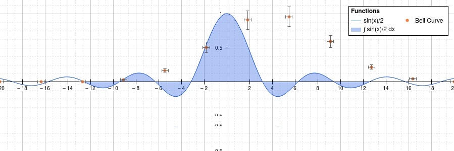

# SciGrapher.js

    

Beautiful graphs out of the box

Scigrapher is a simple yet powefull library capable of producing high quality scientific oriented graphs on the browser. It's based on the HTML canvas element to ensure high responsively and avoid overload the DOM with potentially hundreds of elements.

## Installation

To install just type

    npm install scigrapher

In a terminal on your project folder.

___

Go to the [documentation](https://github.com/JhoselinRam/scigrapher) to learn how to use scigrapher.

All comments and contributes are welcome.